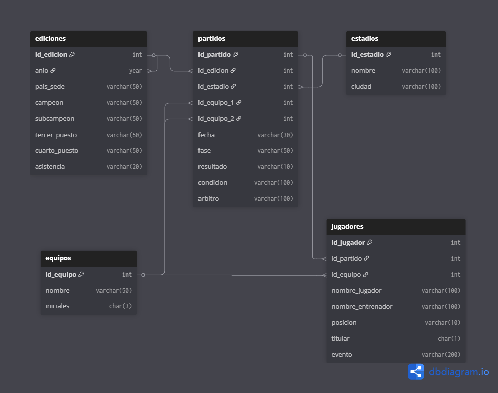

# Normalización - FIFA World Cup Dataset
**Base de Datos II** | UTN Reconquista  
**Integrantes:** Matias Aquino E Isaías Monzón  
**Profesora:** Suligoy, Eliana  
**Dataset:** FIFA World Cup (Kaggle) - abecklas/fifa-world-cup  

---

## Descripción del dataset original

El dataset contiene información sobre todos los Mundiales de Fútbol desde 1930 hasta 2014. Está compuesto por 3 archivos CSV:

- **WorldCups.csv** — 20 filas, una por cada Copa del Mundo
- **WorldCupMatches.csv** — 4.572 filas con todos los partidos jugados
- **WorldCupPlayers.csv** — 37.784 filas con los jugadores que participaron

---

## Problemas identificados en los datos originales

Antes de normalizar se identificaron las siguientes redundancias:

- El nombre del estadio y la ciudad se repiten en cada partido jugado en ese estadio
- El nombre de los equipos se repite en miles de filas
- El año de la Copa del Mundo se repite en cada partido de esa edición
- Las columnas `GoalsScored`, `QualifiedTeams` y `MatchesPlayed` son valores numéricos sin contexto suficiente

---

## Esquema normalizado

Se crearon 5 tablas normalizadas con las siguientes relaciones:



---

## Paso 1 — Crear la base de datos normalizada

```sql
CREATE DATABASE mundial_normalizado CHARACTER SET utf8mb4 COLLATE utf8mb4_unicode_ci;
USE mundial_normalizado;
```

**Por qué:** Se crea una base de datos nueva separada de los datos originales para mantener el "antes" y el "después" de la normalización.

---

## Paso 2 — Tabla `ediciones`

Contiene los datos de cada Copa del Mundo. Se eliminaron las columnas `GoalsScored`, `QualifiedTeams` y `MatchesPlayed` por ser valores numéricos sin contexto suficiente.

```sql
CREATE TABLE ediciones (
    id_edicion    INT          NOT NULL AUTO_INCREMENT,
    anio          YEAR         NOT NULL,
    pais_sede     VARCHAR(50)  NOT NULL,
    campeon       VARCHAR(50)  NOT NULL,
    subcampeon    VARCHAR(50)  NOT NULL,
    tercer_puesto VARCHAR(50)  NOT NULL,
    cuarto_puesto VARCHAR(50)  NOT NULL,
    asistencia    VARCHAR(20),
    PRIMARY KEY (id_edicion)
);
```

Los datos se copian desde la tabla cruda `worldcups` de la base de datos original:

```sql
INSERT INTO ediciones (anio, pais_sede, campeon, subcampeon, tercer_puesto, cuarto_puesto, asistencia)
SELECT Year, Country, Winner, `Runners-Up`, Third, Fourth, Attendance
FROM MUNDIAL.worldcups;
```

**Resultado:** 20 filas insertadas.

---

## Paso 3 — Tabla `equipos`

Contiene cada selección una sola vez. Se usa `DISTINCT` y `UNION` para combinar los equipos de ambas columnas de `worldcupmatches` sin repetir.

```sql
CREATE TABLE equipos (
    id_equipo  INT         NOT NULL AUTO_INCREMENT,
    nombre     VARCHAR(50) NOT NULL,
    iniciales  CHAR(3),
    PRIMARY KEY (id_equipo)
);
```

```sql
INSERT INTO equipos (nombre, iniciales)
SELECT DISTINCT `Home Team Name`, `Home Team Initials`
FROM MUNDIAL.worldcupmatches
WHERE `Home Team Name` != ''
UNION
SELECT DISTINCT `Away Team Name`, `Away Team Initials`
FROM MUNDIAL.worldcupmatches
WHERE `Away Team Name` != '';
```

**Resultado:** 83 filas insertadas.

---

## Paso 4 — Tabla `estadios`

Contiene cada estadio una sola vez con su ciudad. Se usa `DISTINCT` para eliminar repeticiones.

```sql
CREATE TABLE estadios (
    id_estadio  INT          NOT NULL AUTO_INCREMENT,
    nombre      VARCHAR(100) NOT NULL,
    ciudad      VARCHAR(100) NOT NULL,
    PRIMARY KEY (id_estadio)
);
```

```sql
INSERT INTO estadios (nombre, ciudad)
SELECT DISTINCT `Stadium`, `City`
FROM MUNDIAL.worldcupmatches
WHERE `Stadium` != '';
```

**Resultado:** 183 filas insertadas.

---

## Paso 5 — Tabla `partidos`

Tabla principal que relaciona ediciones, estadios y equipos mediante llaves foráneas. El resultado del partido se guarda como texto (ej: "4-2") combinando las dos columnas de goles originales con `CONCAT`. Se incluye la columna `condicion` para registrar casos como "After extra time" o "Penalty shootout".

```sql
CREATE TABLE partidos (
    id_partido    INT          NOT NULL AUTO_INCREMENT,
    id_edicion    INT          NOT NULL,
    id_estadio    INT          NOT NULL,
    id_equipo_1   INT          NOT NULL,
    id_equipo_2   INT          NOT NULL,
    fecha         VARCHAR(30),
    fase          VARCHAR(50),
    resultado     VARCHAR(10),
    condicion     VARCHAR(100),
    arbitro       VARCHAR(100),
    PRIMARY KEY (id_partido),
    FOREIGN KEY (id_edicion)  REFERENCES ediciones(id_edicion),
    FOREIGN KEY (id_estadio)  REFERENCES estadios(id_estadio),
    FOREIGN KEY (id_equipo_1) REFERENCES equipos(id_equipo),
    FOREIGN KEY (id_equipo_2) REFERENCES equipos(id_equipo)
);
```

```sql
INSERT INTO partidos (id_edicion, id_estadio, id_equipo_1, id_equipo_2, fecha, fase, resultado, condicion, arbitro)
SELECT 
    e.id_edicion,
    est.id_estadio,
    eq1.id_equipo,
    eq2.id_equipo,
    m.Datetime,
    m.Stage,
    CONCAT(m.`Home Team Goals`, '-', m.`Away Team Goals`),
    m.`Win conditions`,
    m.Referee
FROM MUNDIAL.worldcupmatches m
JOIN ediciones e ON e.anio = m.Year
JOIN estadios est ON est.nombre = m.Stadium AND est.ciudad = m.City
JOIN equipos eq1 ON eq1.nombre = m.`Home Team Name`
JOIN equipos eq2 ON eq2.nombre = m.`Away Team Name`
WHERE m.Year IS NOT NULL AND m.Stadium != '';
```

**Resultado:** 850 filas insertadas.

---

## Paso 6 — Tabla `jugadores`

Contiene los jugadores que participaron en cada partido, relacionados con su equipo y partido mediante llaves foráneas.

```sql
CREATE TABLE jugadores (
    id_jugador        INT          NOT NULL AUTO_INCREMENT,
    id_partido        INT          NOT NULL,
    id_equipo         INT          NOT NULL,
    nombre_jugador    VARCHAR(100) NOT NULL,
    nombre_entrenador VARCHAR(100),
    posicion          VARCHAR(10),
    titular           CHAR(1),
    evento            VARCHAR(200),
    PRIMARY KEY (id_jugador),
    FOREIGN KEY (id_partido) REFERENCES partidos(id_partido),
    FOREIGN KEY (id_equipo)  REFERENCES equipos(id_equipo)
);
```

```sql
INSERT INTO jugadores (id_partido, id_equipo, nombre_jugador, nombre_entrenador, posicion, titular, evento)
SELECT
    p.id_partido,
    eq.id_equipo,
    pl.`Player Name`,
    pl.`Coach Name`,
    pl.`Position`,
    pl.`Line-up`,
    pl.`Event`
FROM MUNDIAL.worldcupplayers pl
JOIN MUNDIAL.worldcupmatches m ON m.MatchID = pl.MatchID
JOIN partidos p ON p.fecha = m.Datetime AND p.fase = m.Stage
JOIN equipos eq ON eq.iniciales = pl.`Team Initials`
WHERE pl.`Player Name` != '';
```

**Resultado:** 57.492 filas insertadas.

---

## Paso 7 — Vistas

Se crearon 3 vistas que relacionan tablas distintas para facilitar consultas.

### Vista 1: `vista_partidos_completos`

Muestra los partidos con los nombres reales de edición, estadio y equipos en vez de sus IDs.

```sql
CREATE VIEW vista_partidos_completos AS
SELECT 
    e.anio,
    e.pais_sede,
    est.nombre AS estadio,
    est.ciudad,
    eq1.nombre AS equipo_1,
    eq2.nombre AS equipo_2,
    p.fecha,
    p.fase,
    p.resultado,
    p.condicion,
    p.arbitro
FROM partidos p
JOIN ediciones e ON e.id_edicion = p.id_edicion
JOIN estadios est ON est.id_estadio = p.id_estadio
JOIN equipos eq1 ON eq1.id_equipo = p.id_equipo_1
JOIN equipos eq2 ON eq2.id_equipo = p.id_equipo_2;
```

### Vista 2: `vista_jugadores_por_partido`

Muestra los jugadores con el nombre de su equipo y el partido en el que participaron.

```sql
CREATE VIEW vista_jugadores_por_partido AS
SELECT
    j.nombre_jugador,
    j.posicion,
    j.titular,
    j.evento,
    eq.nombre AS equipo,
    p.fecha,
    p.fase,
    p.resultado
FROM jugadores j
JOIN equipos eq ON eq.id_equipo = j.id_equipo
JOIN partidos p ON p.id_partido = j.id_partido;
```

### Vista 3: `vista_campeones`

Muestra los campeones, subcampeones y demás clasificados de cada edición del Mundial.

```sql
CREATE VIEW vista_campeones AS
SELECT
    e.anio,
    e.pais_sede,
    e.campeon,
    e.subcampeon,
    e.tercer_puesto,
    e.cuarto_puesto,
    e.asistencia
FROM ediciones e;
```

---

## Resumen final

| Tabla | Filas | Origen |
|---|---|---|
| `ediciones` | 20 | WorldCups.csv |
| `equipos` | 83 | WorldCupMatches.csv |
| `estadios` | 183 | WorldCupMatches.csv |
| `partidos` | 850 | WorldCupMatches.csv |
| `jugadores` | 57.492 | WorldCupPlayers.csv |
